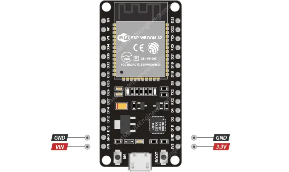
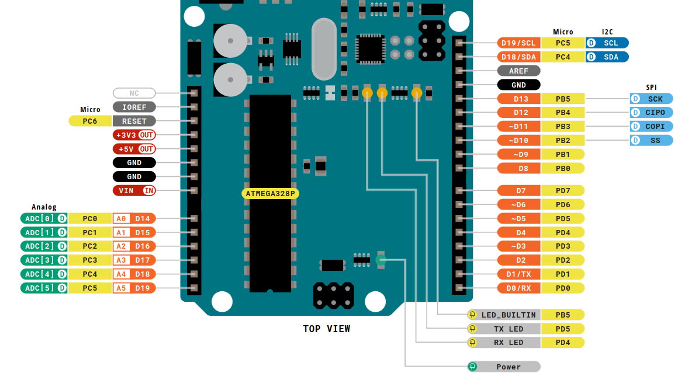

# Aliran Listrik DC

Arus listrik searah (DC) adalah aliran arus listrik yang bergerak dalam satu arah yang tetap, arus listrik ini memiliki dua kutub yaitu Positif dan Negatif

# Istilah dalam Micro Controller

Pada Micro Controller biasanya:

* Positif di tuliskan:
    
        VCC -> (Arus 5V)
        3v3 -> (Arus 3.3V)
        VIN -> (Arus Input)

* Negatif di tuliskan GND

# Battery
Merupakan salah satu seumber Arus DC

# Micro Controller

Pada kedua gambar di atas, Terlihat Penamaan pin untuk arus Positif dan Negatif.