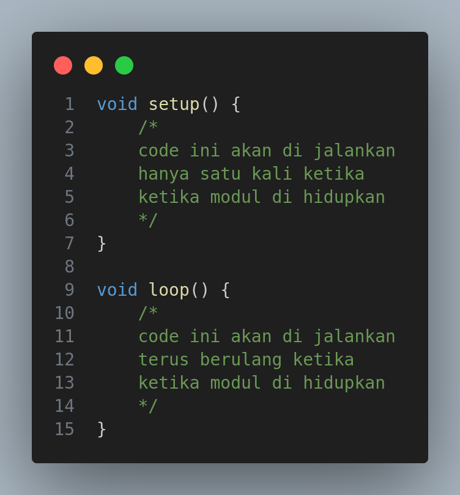

# Pemograman C/C++ di Arduino



# Baca data dari sensor


```cpp
void setup() {
    Serial.begin(9600);
    pinMode(A0, INPUT); // menentukan mode pin sebagai input
}
```

```cpp
void loop() {

    // membaca nilai dari pin A0
    int x = analogRead(A0); // data di konversi ke satuan desimal
    int y = digitalRead(A0); // data di konversi ke satuan bin

    // mencetak nilai di colsole
    Serial.println(x);
}
```

# Mengirim data dari Arduino

```cpp
void setup() {
    Serial.begin(9600);
    pinMode(6, OUTPUT);
}

void loop() {
    // mengirim nilai dari pin A0
    analogWrite(6,200); // data di kirim dalam satuan desimal
    digitalWrite(6, HIGH); // data di kirim dalam satuan bin
}
```
